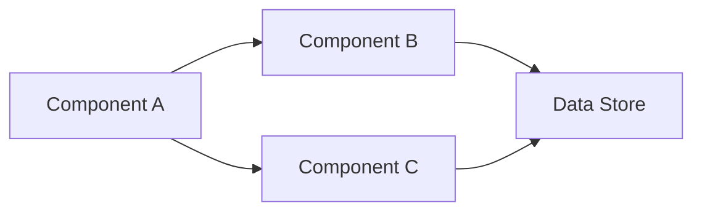
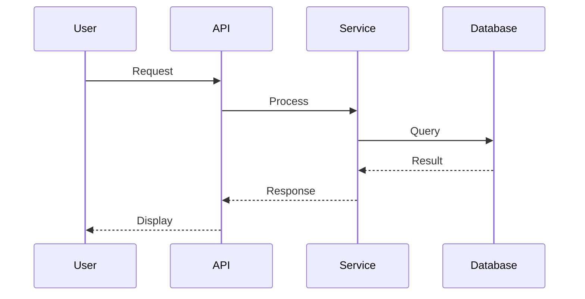
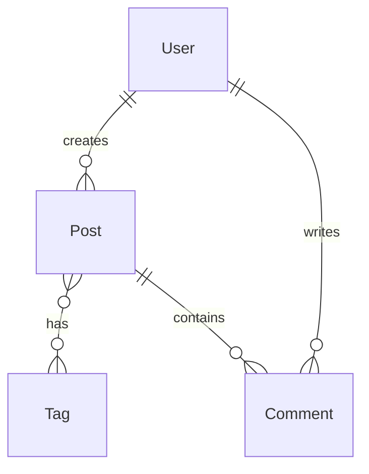

# /ai-pack architect - Architect Role

Activates the **Architect role** for designing technical solutions and system architecture.

## When to Use This Role

Use the Architect role when:
- New feature requires architectural design
- System-wide changes needed
- API design required
- Data model design needed
- Technology decisions required
- Significant technical complexity exists

**Don't use for:** Simple features with obvious implementation (use `/ai-pack engineer` directly)

## Architect Responsibilities

### Phase 1: Requirements Analysis

1. **Read product requirements:**
   - `.ai/tasks/*/00-contract.md` - Task requirements
   - `docs/product/*.md` - PRD (if exists)
   - `docs/design/*/` - UX design (if exists)

2. **Understand constraints:**
   - Performance requirements
   - Scalability needs
   - Security requirements
   - Technology constraints
   - Integration requirements

### Phase 2: Technical Design

Create architecture document in `docs/architecture/`:

```markdown
# Architecture: [Feature Name]

**Date:** [Date]
**Architect:** [Your name]
**Status:** [Draft | Review | Approved]

## Related Documents

- **Requirements:** [Link to PRD]
- **Design:** [Link to UX design]
- **Task:** [Link to task packet]

## Overview

[High-level description of technical solution]

## Architecture Decisions

### Decision 1: [Topic]

**Options Considered:**
1. [Option A] - [Pros/Cons]
2. [Option B] - [Pros/Cons]
3. [Option C] - [Pros/Cons]

**Decision:** [Chosen option]

**Rationale:** [Why this option was chosen]

**Trade-offs:** [What we're accepting]

### Decision 2: [Topic]
[... repeat for each major decision ...]

## System Design

### Components

- **Component A** - [Purpose] - [Responsibilities]
- **Component B** - [Purpose] - [Responsibilities]

### Component Diagram



### Data Flow



## API Design

### Endpoints

**POST /api/resource**
- Purpose: [What it does]
- Request: [Schema]
- Response: [Schema]
- Errors: [Error cases]

[... additional endpoints ...]

### API Contracts

```json
{
  "request": {
    "field1": "string",
    "field2": "integer"
  },
  "response": {
    "id": "string",
    "status": "string"
  }
}
```

## Data Model

### Entities

**Entity: User**
```
User {
  id: UUID (PK)
  email: String (unique, indexed)
  created_at: Timestamp
  updated_at: Timestamp
}
```

**Entity: [Other Entity]**
[... additional entities ...]

### Relationships



### Database Schema

[ERD or schema description]

## Security Considerations

- **Authentication:** [Approach]
- **Authorization:** [Approach]
- **Data Protection:** [Encryption, PII handling]
- **Vulnerabilities:** [Known risks and mitigations]

## Performance Considerations

- **Expected Load:** [Requests/sec, users, data volume]
- **Scalability:** [Horizontal/vertical scaling approach]
- **Caching:** [What, where, TTL]
- **Optimization:** [Critical paths to optimize]

## Implementation Phases

### Phase 1: [Name]
- [Task 1]
- [Task 2]

### Phase 2: [Name]
- [Task 3]
- [Task 4]

## Testing Strategy

- **Unit Tests:** [What to test]
- **Integration Tests:** [What to test]
- **E2E Tests:** [What to test]
- **Performance Tests:** [Benchmarks]

## Deployment Strategy

- **Migration Path:** [How to deploy changes]
- **Rollback Plan:** [How to undo if needed]
- **Feature Flags:** [What's behind flags]

## Open Questions

- [ ] [Question 1] - [Who needs to answer]
- [ ] [Question 2] - [Who needs to answer]

## References

- [External docs, RFCs, etc.]
```

### Phase 3: Architecture Decision Records (ADRs)

For significant decisions, create ADR in `docs/adr/`:

```markdown
# ADR-NNN: [Decision Title]

**Date:** [Date]
**Status:** [Proposed | Accepted | Deprecated | Superseded]

## Context

[What is the issue we're facing?]

## Decision

[What decision did we make?]

## Consequences

**Positive:**
- [Benefit 1]
- [Benefit 2]

**Negative:**
- [Trade-off 1]
- [Trade-off 2]

**Neutral:**
- [Impact 1]

## Alternatives Considered

1. [Alternative 1] - [Why rejected]
2. [Alternative 2] - [Why rejected]
```

### Phase 4: Collaboration

1. **Technical feasibility feedback:**
   - Work with Cartographer on requirements
   - Validate UX design is technically feasible
   - Identify implementation risks

2. **Implementation guidance:**
   - Create task packets for Engineers
   - Provide technical context
   - Review implementation for architecture compliance

### Phase 5: Artifact Persistence

**MANDATORY:** Persist all architecture artifacts

1. Save to `docs/architecture/[feature-name].md`
2. Save ADRs to `docs/adr/ADR-NNN-[title].md`
3. Cross-reference with:
   - PRD (link in both directions)
   - UX design
   - Task packets
   - Related ADRs
4. Commit to repository

## Reference Documentation

**Primary:** [.ai-pack/roles/architect.md](../../.ai-pack/roles/architect.md)

**Gates:**
- [.ai-pack/gates/10-persistence.md](../../.ai-pack/gates/10-persistence.md) - Document persistence

**Workflows:**
- [.ai-pack/workflows/feature.md](../../.ai-pack/workflows/feature.md) - Feature workflow (Phase 0)

## Related Commands

- `/ai-pack pm` - Cartographer for requirements
- `/ai-pack designer` - Designer for UX workflows
- `/ai-pack engineer` - Delegate implementation
- `/ai-pack help` - Show all commands

## Activation

This command will:
1. Load the Architect role definition
2. Guide you through architecture design
3. Help create architecture documents and ADRs
4. Ensure proper artifact persistence

Ready to design the architecture?
